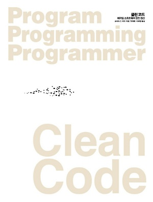

  
  <h1>Clean Code 클린 코드</h1>
  

    
    
    

  

  

## 📝 목차

- [0주차(OT)](https://github.com/code-bibliotheca/clean-code/blob/main/0%EC%A3%BC%EC%B0%A8/0%EC%A3%BC%EC%B0%A8.md)
- [1주차(1~3장)](https://github.com/code-bibliotheca/clean-code/blob/main/1%EC%A3%BC%EC%B0%A8/1%EC%A3%BC%EC%B0%A8.md)
  - 1장. 깨끗한 코드
  - 2장. 의미 있는 이름
  - 3장. 함수
- [2주차(4~6장)](https://github.com/code-bibliotheca/clean-code/blob/main/2%EC%A3%BC%EC%B0%A8/2%EC%A3%BC%EC%B0%A8.md)
  - 4장. 주석
  - 5장. 형식 맞추기
  - 6장. 객체와 자료 구조
- [3주차(7~9장)](https://github.com/code-bibliotheca/clean-code/blob/main/3%EC%A3%BC%EC%B0%A8/3%EC%A3%BC%EC%B0%A8.md)
  - 7장. 오류 처리
  - 8장. 경계
  - 9장. 단위 테스트
- [4주차(10~12장)](https://github.com/code-bibliotheca/clean-code/blob/main/4%EC%A3%BC%EC%B0%A8/4%EC%A3%BC%EC%B0%A8.md)
  - 10장. 클래스
  - 11장. 시스템
  - 12장. 창발성
- [5주차(13~14장)](https://github.com/code-bibliotheca/clean-code/blob/main/5%EC%A3%BC%EC%B0%A8/5%EC%A3%BC%EC%B0%A8.md)
  - 13장. 동시성
  - 14장. 점진적인 개선
- 6주차
  - 💬 느낀점 및 차후 계획

  

## 📌 스터디 규칙

- **매주 토요일 10:00 (2~3시간) or 평일 저녁**
- **장소:** 강남역 인근 스터디 카페
- **기간:** 책 1권당 6~8주, 해당 책 마무리되면 새로운 책으로 스터디 시작
- **시간**: 토요일 9~10시 시작(팀원간의 조율)
- **1회** **완독 및 의견 공유**를 목표로 합니다.
- **주 1회 3장(챕터) 이상** 읽고, <a href="https://github.com/code-bibliotheca/clean-code-presentation">GitHub Presentaion</a> **에 아카이빙**합니다.
- **주마다 한 명씩(서기)** 돌아가며**종합**해 올립니다.
- 아카이빙 하는 내용은 필요한 내용, 몰랐던 내용, 공유하고 싶은 내용, 나중에 다시 볼 내용 등 **자유롭게 작성**합니다.

- 클린코드는 총 **17장의 챕터**입니다. 주마다 3장을 목표로 합니다.
- 읽고 이해가 안 되는 점, 추가적으로 공유하고 싶은 정보 등은 카카오톡 혹은 디스코드**에서 공유**합니다.
- 지각하면 분당 1만원
- 참가자가 과반수 이상 불참시 평일로 약속 다시잡기
- 참가자 불참시 줌으로 참여해서 의지 보여주기
- 준비물 : 노트북(default)
- 서기는 해당 주차를 PR 로 올리면 Comment 로 다음 회차 및 해당 회차 작업에 대해서 이야기 해봐요~
- 각 주차에 대한 기록은 바로바로~~ PR 없이 올려주세요!

  

## 🐬 Members

<table>
  <tr>
    <td align="center"><a href="https://github.com/YoujungSon">  <b>yyoujg</b></a> 
    </td>
    <td align="center"><a href="https://github.com/jiji-hoon96">  <b>JIHOON LEE</b></a> </td>
    <td align="center"><a href="https://github.com/bubobubobo">  <b>sujong</b></a> </td>
    <td align="center"><a href="https://github.com/hanyiseo2">  <b>Hanyi SEO</b></a> </td>
    <td align="center"><a href="https://github.com/jihyeon-kimy">  <b>jihyeon kim</b></a> </td>
    <td align="center"><a href="https://github.com/tpdud406">  <b>이세영(LeeSeYoung)</b></a> </td>

  </tr>
</table>

  

## 🗓️ 진행 상황

| 진행 상황 | 온/오프라인 참석 | 미참석 | 서기 |
| :-------: | :--------------: | :----: | :--: |
|   표기    |        😀        |   ❌   |  ✏️  |

|  주차   |     날짜      |                                                       내용                                                       | 수종 | 유정 | 지훈 | 지현 | 한이 | 세영 |
| :-----: | :-----------: | :--------------------------------------------------------------------------------------------------------------: | :--: | :--: | :--: | :--: | :--: | :--: |
| week_00 | 06-09 ~ 06-10 | [0주차(OT)](https://github.com/code-bibliotheca/clean-code/blob/main/0%EC%A3%BC%EC%B0%A8/0%EC%A3%BC%EC%B0%A8.md) |  😀  |  😀  |  😀  |  ❌  |  😀  | |
| week_01 | 06-10 ~ 06-16 |   [1주차](https://github.com/code-bibliotheca/clean-code/blob/main/1%EC%A3%BC%EC%B0%A8/1%EC%A3%BC%EC%B0%A8.md)   |  😀  |  ❌  |  ✏️  |  😀  |  😀  | |
| week_02 | 06-17 ~ 06-23 |   [2주차](https://github.com/code-bibliotheca/clean-code/blob/main/1%EC%A3%BC%EC%B0%A8/1%EC%A3%BC%EC%B0%A8.md)   |  ✏️  |  😀  |  😀  |  ❌  |  😀  | | 
| week_03 | 06-24 ~ 06-30 |   [3주차](https://github.com/code-bibliotheca/clean-code/blob/main/3%EC%A3%BC%EC%B0%A8/3%EC%A3%BC%EC%B0%A8.md)   |  😀  |  ✏️  |  😀  |  😀  |  ❌  | |
| week_04 | 07-01 ~ 07-07 |   [4주차](https://github.com/code-bibliotheca/clean-code/blob/main/4%EC%A3%BC%EC%B0%A8/4%EC%A3%BC%EC%B0%A8.md)   |  😀  |  😀  |  😀  |  😀  |  ✏️  | 😀 |
| week_05 | 07-08 ~ 07-14 |   [5주차](https://github.com/code-bibliotheca/clean-code/blob/main/5%EC%A3%BC%EC%B0%A8/5%EC%A3%BC%EC%B0%A8.md)   |  😀  |  😀  |  😀  |  ✏️  |  😀  | 😀 |
